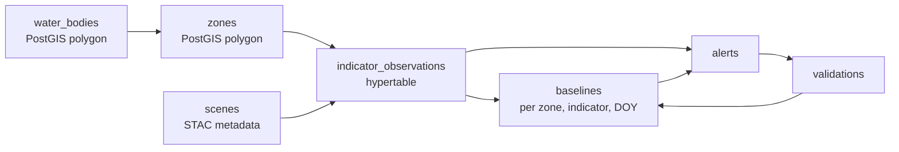

# JalNetra — Maharashtra State-Wide Implementation Plan

2026-09-21 · @Someone

Satellite-based water quality & contamination intelligence · PS-6

## Scope and what "real time" means here

Satellite optical imagery cannot be real time. Sentinel-2 revisits Maharashtra every 2–5 days, and Level-2A surface reflectance lands on the Copernicus Data Space Ecosystem within hours of the pass. So JalNetra's promise is **a fresh verdict within hours of every satellite pass**, not a live feed.

State this openly in the pitch. A judge who knows remote sensing will ask, and the honest answer is stronger than an overclaim.

| Signal | Cadence | Latency after acquisition |
| --- | --- | --- |
| Sentinel-2 L2A optical | 2–5 days | \~3–24 hours |
| Sentinel-1 SAR (water extent, cloud-penetrating) | 6–12 days | \~3–24 hours |
| IMD / rainfall gridded | Daily | \~24 hours |
| Ground station readings (CPCB / MPCB) | Weekly–monthly | Days |

### Filling the gap between passes

The dashboard must never look stale. Three things run continuously while no new scene exists:

1. **Rainfall overlay** — updates daily, and is the single most useful covariate for suppressing false positives.
2. **Countdown to next pass** — computed from the Sentinel-2 orbit schedule per MGRS tile, so every water body shows "next observation in 2 days".
3. **Open alerts queue** — anomalies stay live until a field team closes them, so the priority list is always current.

### Coverage target

Maharashtra has roughly 1,821 notable large dams per the National Register of Large Dams, plus thousands of minor tanks and river stretches. Do not try to monitor all of them. Tier the inventory:

- **Tier 1 (\~120 water bodies)** — major reservoirs, drinking-water sources, and urban river stretches. Full pipeline, every pass.
- **Tier 2 (\~600)** — medium reservoirs. Full pipeline, weekly composite.
- **Tier 3 (rest)** — monthly water-extent check only; promoted to Tier 2 if a change is detected.

This tiering is what makes state-wide coverage affordable. It is also a defensible product decision, not a compromise.

## Phased roadmap

Build P0 end-to-end on one water body before touching state scale. A working narrow pipeline beats a broad broken one, and the demo only ever shows one lake anyway.

| Phase | Scope | Ships | Build effort |
| --- | --- | --- | --- |
| **P0 — Prototype** | 1 water body, 12 historical dates | Full pipeline L3→L12, mock-free, real Sentinel-2 data | Hackathon |
| **P1 — District pilot** | Pune district, \~25 water bodies | Scheduled ingestion, real baselines, rainfall covariate, PDF briefs | 4–6 weeks |
| **P2 — State-wide** | Tier 1 + Tier 2, \~720 water bodies | Distributed workers, tile server, alert routing to MPCB divisions | 3–4 months |
| **P3 — Operational** | Full inventory + validation loop | Field app, model retraining from lab results, SLA monitoring | 6–12 months |

### What P0 must prove

The prototype is not a demo of satellite imagery. It is a demo of four claims, in this order:

1. We can isolate a water body through cloud and seasonal change.
2. We can show an indicator deviating from its own historical baseline.
3. We can explain, in plain language, why a zone was flagged.
4. We can rank zones so a field team knows where to go first.

If a feature does not serve one of those four, cut it from P0.

### Pick one demo water body

Use a Pune-district water body with a known, documented water-quality event so the anomaly you detect is real and defensible. Khadakwasla Reservoir or the Mula-Mutha stretch through the city both work, and both are close enough to home that a judge can place them.

## Scale maths and the one decision that matters

**Never download full Sentinel-2 tiles.** Read only the pixels inside each water body, directly from the Cloud-Optimized GeoTIFFs over HTTP. This single decision is the difference between 13 GB and roughly 120 MB per pass, and it is what makes state-wide coverage run on a single modest server.

### The arithmetic

Maharashtra is about 307,700 km², covered by roughly 40 Sentinel-2 MGRS tiles (110 × 110 km each).

| Approach | Bands needed | Data per pass | Feasible state-wide? |
| --- | --- | --- | --- |
| Download full L2A products | All | \~48 GB | No |
| Download 6 bands, full tiles | B3 B4 B5 B8 B11 SCL | \~13 GB | Barely, with a big disk |
| **Windowed COG reads over water bodies only** | Same 6 | **\~120 MB** | Yes |

Water surface is roughly 1–2% of Maharashtra's land area, which is where the 100× reduction comes from.

### How windowed reads work

`rasterio` opens a remote COG through GDAL's `/vsicurl/` driver and issues HTTP range requests for only the tiles of the image that intersect your window. You pass the water body's bounding box; you get back a small array.

```python
import rasterio
from rasterio.windows import from_bounds

url = "/vsicurl/https://<stac-asset-href>/B04.tif"
with rasterio.open(url) as src:
    win = from_bounds(*aoi_bounds_in_src_crs, transform=src.transform)
    red = src.read(1, window=win)
```

Set `GDAL_DISABLE_READDIR_ON_OPEN=EMPTY_DIR` and `CPL_VSIL_CURL_ALLOWED_EXTENSIONS=.tif` in the worker environment, or GDAL will make dozens of wasted requests per open.

### Bands to pull

| Band | Wavelength | Resolution | Used for |
| --- | --- | --- | --- |
| B3 | 560 nm green | 10 m | NDWI, NDTI, MNDWI |
| B4 | 665 nm red | 10 m | NDTI, NDCI, sediment proxy |
| B5 | 705 nm red edge | 20 m | NDCI chlorophyll |
| B8 | 842 nm NIR | 10 m | NDWI, FAI |
| B11 | 1610 nm SWIR | 20 m | MNDWI, FAI |
| SCL | — | 20 m | Cloud, shadow, cirrus masking |

### Processing budget

At Tier 1 + Tier 2 scale, roughly 720 water bodies × 6 bands × \~20 MB of windowed reads per pass, with 8 Celery workers, completes in well under an hour. Store only the derived indicator rasters as small COG chips, not the source bands.

## External APIs and data sources

Use [Copernicus Data Space Ecosystem](https://dataspace.copernicus.eu/) as the primary source and [Earth Search](https://earth-search.aws.element84.com/v1) as the fallback. Both are free, both serve STAC, and having two means a single outage does not kill your demo.

### Satellite imagery

| Source | Endpoint | Auth | Use for |
| --- | --- | --- | --- |
| [CDSE STAC](https://documentation.dataspace.copernicus.eu/APIs/STAC.html) | `https://stac.dataspace.copernicus.eu/v1/` | Free account; OAuth2 token for downloads | Primary scene search, collection `sentinel-2-l2a` |
| CDSE OData | `https://catalogue.dataspace.copernicus.eu/odata/v1/Products` | Same | Filter by tile, date, cloud cover |
| CDSE S3 | `eodata` bucket, S3 protocol | Access key from CDSE dashboard | Bulk or direct band access |
| [Earth Search (AWS)](https://earth-search.aws.element84.com/v1) | `https://earth-search.aws.element84.com/v1` | None | Fallback STAC, `sentinel-2-l2a` COGs |
| [Planetary Computer](https://planetarycomputer.microsoft.com/) | `https://planetarycomputer.microsoft.com/api/stac/v1` | Free token via `planetary-computer` package | Second fallback, signed asset URLs |
| [Google Earth Engine](https://earthengine.google.com/) | Python `ee` API | Service account | Fast historical baseline build over many dates |

A practical split: use Earth Engine once to compute several years of historical baseline statistics per water body, then run the operational pipeline on CDSE COGs. Earth Engine is excellent at "reduce 5 years of imagery to one number per zone" and poor as a production serving layer.

### Water body inventory

| Source | Endpoint | Use for |
| --- | --- | --- |
| [JRC Global Surface Water](https://global-surface-water.appspot.com/) | GEE asset `JRC/GSW1_4/GlobalSurfaceWater` | Derive the water body polygon inventory from occurrence > 50% |
| [HydroLAKES](https://www.hydrosheds.org/products/hydrolakes) | Shapefile download | Named lakes and reservoirs with attributes |
| OpenStreetMap | Overpass API, `natural=water` in Maharashtra | Names, local identifiers, river polygons |
| [India-WRIS](https://indiawris.gov.in/) | `https://indiawris.gov.in/wris/` REST | Reservoir levels, CWC storage, official names |
| [Bhuvan / ISRO](https://bhuvan.nrsc.gov.in/) | WMS / WFS services | Indian basemap and credibility in an Indian jury room |

### Context and ground truth

| Source | Endpoint | Use for |
| --- | --- | --- |
| [IMD gridded rainfall](https://mausam.imd.gov.in/) | NetCDF downloads; or [Open-Meteo](https://open-meteo.com/) `https://archive-api.open-meteo.com/v1/archive` | Rainfall covariate — the false-positive killer |
| CPCB NWMP | [cpcb.nic.in](https://cpcb.nic.in/) water-quality data portal | Ground-truth station readings for validation |
| MPCB | [mpcb.gov.in](https://mpcb.gov.in/) | Maharashtra station data and jurisdiction boundaries |
| Open-Meteo | `https://api.open-meteo.com/v1/forecast` | No-key weather, use this for P0 instead of IMD |

CPCB and MPCB publish mostly as PDFs and portal tables, not APIs. Budget time for a scraper, or for P0 simply hand-enter a dozen station readings as seed validation records — and say so honestly in the demo.

### One API key rule

Everything above except Earth Engine and CDSE downloads works without credentials. Build P0 on the no-key path (Earth Search + Open-Meteo) so nothing blocks you at 3 a.m., then add CDSE auth in P1.

## Internal API contract

Freeze this before anyone writes frontend code. The Replit mock JSON and the FastAPI responses must match field-for-field, or you will spend the last night of the hackathon renaming keys.

### Endpoints

| Method | Path | Returns |
| --- | --- | --- |
| GET | `/api/v1/water-bodies` | List with tier, area, latest observation, status |
| GET | `/api/v1/water-bodies/{id}` | Detail + GeoJSON boundary + zone polygons |
| GET | `/api/v1/water-bodies/{id}/observations` | Available dates with cloud cover and usability flag |
| GET | `/api/v1/water-bodies/{id}/indicators?date=&zone=` | Indicator values + baseline + deviation |
| GET | `/api/v1/water-bodies/{id}/series?indicator=&from=&to=` | Time series for charting, with baseline band |
| GET | `/api/v1/alerts?status=&severity=&min_priority=` | Alert list, priority descending |
| GET | `/api/v1/alerts/{id}` | Full alert with explanation and evidence |
| GET | `/api/v1/alerts/{id}/brief.pdf` | Generated investigation brief |
| GET | `/api/v1/alerts.geojson` | Alert feed as GeoJSON for map layers |
| POST | `/api/v1/validations` | Submit a field or lab result against an alert |
| GET | `/api/v1/validations` | Submitted validations with match verdict |
| POST | `/api/v1/jobs/ingest` | Trigger ingestion for a water body and date range |
| GET | `/api/v1/jobs/{id}` | Job status for the pipeline progress UI |
| GET | `/tiles/{layer}/{z}/{x}/{y}.png` | Raster tiles via TiTiler |

### Core response shapes

```json
{
  "alert_id": "alr_2026_0917_khadakwasla_z3",
  "water_body": { "id": "wb_khadakwasla", "name": "Khadakwasla Reservoir", "district": "Pune" },
  "zone": { "id": "z3", "name": "Eastern zone", "centroid": [73.7712, 18.4419] },
  "observed_on": "2026-09-17",
  "affected_area_km2": 2.47,
  "primary_indicator": "ndti_turbidity",
  "severity": "high",
  "confidence": 0.89,
  "priority_score": 87,
  "status": "open",
  "indicators": [
    { "key": "ndti_turbidity", "value": 0.312, "baseline_mean": 0.128,
      "baseline_std": 0.021, "z_score": 8.76, "deviation_pct": 143.8 }
  ],
  "explanation": {
    "summary": "Flagged because the turbidity indicator is 2.4x its seasonal baseline across 2.47 km2 of the eastern zone, with a correlated rise in suspended sediment.",
    "contributions": [
      { "factor": "Turbidity deviation from baseline", "value": 0.41 },
      { "factor": "Spatial extent of affected pixels", "value": 0.24 },
      { "factor": "Suspended sediment correlation", "value": 0.19 },
      { "factor": "Rainfall in preceding 72h", "value": -0.12 }
    ]
  },
  "context": { "rainfall_72h_mm": 4.2, "cloud_cover_pct": 8.1, "natural_cause_likely": false },
  "evidence": {
    "baseline_composite_url": "/tiles/baseline/...",
    "current_observation_url": "/tiles/current/...",
    "anomaly_mask_url": "/tiles/anomaly/..."
  },
  "disclaimer": "Satellite-observed anomaly. Ground and laboratory testing recommended for validation."
}
```

Note the negative contribution for rainfall. That single field is your explainability story: the model actively discounts anomalies that heavy rain explains.

### Conventions

- Dates `YYYY-MM-DD`, timestamps RFC 3339 UTC.
- Coordinates `[lon, lat]`, EPSG:4326, GeoJSON order.
- Areas in km², rainfall in mm, all indicator values unitless index ratios.
- Every alert response carries `disclaimer` verbatim. The frontend renders it; it is never optional.

## Data model

PostGIS holds geometry and alerts; TimescaleDB holds the indicator time series as a hypertable. Rasters never go in the database — only object-store paths.



### Tables

| Table | Key columns | Notes |
| --- | --- | --- |
| `water_bodies` | `id`, `name`, `district`, `tier`, `geom(Polygon,4326)`, `area_km2` | GIST index on `geom` |
| `zones` | `id`, `water_body_id`, `name`, `geom`, `area_km2` | 4–8 zones per body, from k-means on the water mask |
| `scenes` | `id`, `mgrs_tile`, `sensed_at`, `cloud_pct`, `stac_href`, `usable` | One row per Sentinel-2 pass |
| `indicator_observations` | `zone_id`, `scene_id`, `observed_at`, `indicator`, `mean`, `p90`, `valid_pixel_pct` | **Hypertable**, partitioned on `observed_at` |
| `baselines` | `zone_id`, `indicator`, `doy_window`, `mean`, `std`, `p10`, `p90`, `n_samples` | Seasonal, keyed on day-of-year window |
| `rainfall` | `water_body_id`, `date`, `mm_24h`, `mm_72h` | Daily, drives the covariate |
| `alerts` | `id`, `zone_id`, `observed_at`, `severity`, `confidence`, `priority_score`, `status`, `explanation jsonb` | `status`: open, investigating, validated, dismissed |
| `validations` | `id`, `alert_id`, `sampled_on`, `lab_results jsonb`, `verdict`, `submitted_by` | `verdict`: matched, not\_matched, inconclusive |
| `raster_chips` | `zone_id`, `scene_id`, `layer`, `s3_key`, `bounds` | COG chips for map display |

### The hypertable

```sql
CREATE TABLE indicator_observations (
  observed_at      TIMESTAMPTZ NOT NULL,
  zone_id          TEXT NOT NULL REFERENCES zones(id),
  scene_id         TEXT NOT NULL REFERENCES scenes(id),
  indicator        TEXT NOT NULL,
  mean             DOUBLE PRECISION,
  p90              DOUBLE PRECISION,
  valid_pixel_pct  REAL,
  PRIMARY KEY (observed_at, zone_id, indicator)
);
SELECT create_hypertable('indicator_observations', 'observed_at');
CREATE INDEX ON indicator_observations (zone_id, indicator, observed_at DESC);
```

### Object storage layout

```
s3://jalnetra/
  chips/{water_body_id}/{scene_date}/{zone_id}/{layer}.tif
  composites/{water_body_id}/{doy_window}/baseline.tif
  briefs/{alert_id}.pdf
```

`layer` is one of `truecolor`, `watermask`, `ndti`, `ndci`, `fai`, `anomaly`. Keep chips small — a zone chip is typically under 200 KB, so a year of Tier 1 chips fits in a few GB.

## Claude Code prompts — S0 to S3

Paste one section at a time, in order. Each is self-contained. Do not paste all thirteen at once — Claude Code will over-scope and you will get shallow code across the board instead of working code in sequence.

Start every session with this preamble, once:

```
PROJECT: JalNetra — satellite-based water quality and contamination
intelligence for Maharashtra. Monorepo. Python 3.11 backend, React 18
frontend, PostgreSQL 16 + PostGIS + TimescaleDB, Redis, Celery, Docker
Compose for local dev.

PRODUCT BOUNDARY — enforce this in all code, comments, API fields and UI
copy: the system detects POTENTIAL ANOMALIES in satellite-observable
indicators and prioritises zones for ground investigation. It never claims
to detect, prove or confirm pollution or contamination. Every alert payload
carries a `disclaimer` field. Never name a variable, endpoint or label
"pollution_detected" or similar.

ARCHITECTURE — 13 layers, build in order:
L1 Presentation · L2 API & orchestration · L3 Satellite ingestion ·
L4 Preprocessing · L5 Water body detection · L6 Spectral indicators ·
L7 Data & baseline · L8 Anomaly detection · L9 Fusion & priority ·
L10 Explainability · L11 Alert & report · L12 Output & delivery ·
L13 Ground & lab validation loop

I will give you one section at a time. Build only that section. Write tests
for it. Stop and wait for the next section.
```

### S0 — Repository scaffold and infrastructure

```
SECTION S0 — SCAFFOLD

Tech stack: Python 3.11, uv or Poetry, FastAPI, Celery, Redis, PostgreSQL 16
+ PostGIS 3.4 + TimescaleDB, MinIO, Docker Compose, pytest, ruff, mypy.

Build:
- Monorepo: /backend (FastAPI app + Celery workers), /frontend (Vite React,
  empty for now), /infra (compose + init SQL), /notebooks.
- docker-compose.yml with services: api, worker, beat, postgres (image
  timescale/timescaledb-ha:pg16 with PostGIS), redis, minio, titiler.
- backend/app structure: api/, core/ (config, logging), db/ (session,
  models, migrations), services/ (one package per layer L3-L13),
  workers/ (celery app + tasks), schemas/ (Pydantic v2).
- Pydantic Settings reading .env; provide .env.example with every key.
- Alembic configured with PostGIS-safe migrations.
- Structured JSON logging with a request id and a job id in every record.
- Makefile: make up, make migrate, make test, make lint, make seed.
- GitHub Actions running ruff, mypy, pytest.

Acceptance: `make up && make migrate && make test` succeeds on a clean
clone. `GET /health` returns service status for postgres, redis and minio.
```

### S1 — Water body registry

```
SECTION S1 — WATER BODY REGISTRY (feeds L3-L5)

Tech stack: GeoPandas, Shapely, Fiona, SQLAlchemy 2.0 + GeoAlchemy2,
Alembic, requests, Overpass API, JRC Global Surface Water.

Build:
- Models water_bodies and zones per the data model, with GIST indexes.
- Ingestion CLI `python -m app.services.registry.load` that accepts a GeoJSON
  or shapefile of Maharashtra water bodies and upserts them with
  district, tier (1/2/3), area_km2 and MGRS tile ids they intersect.
- An MGRS resolver: given a polygon, return every Sentinel-2 tile id
  covering it. Use the Sentinel-2 KML grid, cached locally.
- Zone generator: given a water body polygon, split it into 4-8 contiguous
  zones by k-means over pixel centroids, persist as zones rows. Zones must
  tile the polygon with no gaps or overlaps.
- Seed script loading 25 Pune-district water bodies including Khadakwasla,
  Panshet, Varasgaon, Pashan Lake and the Mula-Mutha river stretch, with
  real coordinates.

Acceptance: seeding produces >= 25 water bodies with valid geometry; every
water body resolves to at least one MGRS tile; zone areas sum to the parent
area within 1%.
```

### S2 — Satellite ingestion service (L3)

```
SECTION S2 — SATELLITE INGESTION (L3)

Tech stack: pystac-client, rasterio + GDAL /vsicurl, Celery, Redis,
boto3/minio, tenacity for retries.

Build:
- A STACSource abstraction with two implementations:
  EarthSearchSource (https://earth-search.aws.element84.com/v1, no auth,
  default) and CDSESource (https://stac.dataspace.copernicus.eu/v1/, OAuth2
  client-credentials token, refreshed on expiry). Same interface, selected
  by config, automatic fallback on failure.
- search_scenes(water_body_id, date_from, date_to, max_cloud_pct) querying
  collection sentinel-2-l2a by tile and date, persisting scenes rows with
  cloud_pct, sensed_at, stac_href and a usable flag.
- WINDOWED READS ONLY. Never download a whole product. Open each band asset
  through /vsicurl/ and read only the window covering the water body bounds.
  Set GDAL_DISABLE_READDIR_ON_OPEN=EMPTY_DIR and
  CPL_VSIL_CURL_ALLOWED_EXTENSIONS=.tif in the worker env.
- Bands: B3, B4, B5, B8, B11, SCL. Resample 20m bands to 10m with bilinear
  so all arrays share a grid.
- Celery task ingest_water_body(water_body_id, date) with exponential
  backoff, idempotent on (water_body_id, scene_id).
- Celery beat schedule: poll for new scenes for Tier 1 every 6 hours.
- Cache the raw windowed arrays to MinIO so reprocessing does not refetch.

Acceptance: ingesting one real date for Khadakwasla pulls under 30 MB,
completes in under 60 seconds, and writes a scenes row plus cached arrays.
Rerunning it is a no-op.
```

### S3 — Preprocessing and water mask (L4 + L5)

```
SECTION S3 — PREPROCESSING AND WATER MASK (L4 + L5)

Tech stack: NumPy, rasterio, scikit-image, scipy.ndimage, OpenCV,
xarray (optional).

Build L4 preprocessing:
- Cloud, shadow and cirrus mask from the SCL band. Mask out SCL classes
  3 (cloud shadow), 8 (cloud medium probability), 9 (cloud high
  probability), 10 (thin cirrus), 11 (snow/ice). Keep 6 (water) and
  4/5 (vegetation/bare) for the land comparison.
- Dilate the cloud mask by 2 pixels to catch cloud edges.
- Reject a scene for a water body if valid_pixel_pct < 40% over the AOI;
  mark the scenes row usable = false and skip downstream work.

Build L5 water detection:
- Compute NDWI = (B3 - B8) / (B3 + B8) and MNDWI = (B3 - B11) / (B3 + B11).
- Threshold with Otsu on the MNDWI histogram rather than a fixed 0.0, so
  the mask adapts to season and turbidity.
- Morphological opening then closing (3x3) to remove speckle, then keep
  only connected components larger than 0.01 km2.
- Intersect with the registered water body polygon buffered by 60 m, so a
  flooded field next door is not counted as the reservoir.
- Persist the mask as a COG chip and record water_extent_km2 per scene.

Acceptance: for a known monsoon date and a known summer date on the same
reservoir, water_extent_km2 differs measurably and both masks visually
match the reservoir outline. Unit tests cover a synthetic array with a
known water region.
```

## Claude Code prompts — S4 to S7

These four sections are the product. Everything before them is plumbing and everything after is presentation.

### S4 — Spectral indicator engine (L6)

```
SECTION S4 — SPECTRAL INDICATOR ENGINE (L6)

Tech stack: NumPy, rasterio, scikit-learn (for zonal stats helpers),
TimescaleDB via SQLAlchemy.

Build an indicator registry where each indicator is a class with: key,
display_name, formula_doc, required_bands, compute(bands) -> array,
valid_range, and scientific_basis (a short string explaining what it
proxies and its limitations). The UI and the PDF brief both read
scientific_basis, so write it properly.

Implement:
- ndti_turbidity  = (B4 - B3) / (B4 + B3)
- ndci_chlorophyll = (B5 - B4) / (B5 + B4)
- fai_algal       = B8 - (B4 + (B11 - B4) * (842 - 665) / (1610 - 665))
- sediment_proxy  = B4 reflectance, water pixels only
- mndwi_extent    = reused from S3 for water area tracking

Rules:
- Compute over water-mask pixels only. Land and cloud pixels are NaN.
- Clip each indicator to its valid_range and record the clipped fraction.
- Zonal aggregation per zone: mean, p90, std, valid_pixel_pct. Reject a
  zone-indicator record if valid_pixel_pct < 30.
- Write results into indicator_observations (the hypertable).
- Write one COG chip per indicator per scene into MinIO.

Each indicator's scientific_basis must state what it is a proxy for and
what confounds it. Example for NDTI: "Red-to-green reflectance ratio;
rises with suspended particulate matter. Confounded by bottom reflectance
in shallow water, sun glint, and high chlorophyll. A satellite proxy, not
a calibrated NTU measurement."

Acceptance: running S4 on a real scene produces 4 indicators x N zones in
the hypertable and 4 chips in MinIO. Indicator values fall in plausible
ranges (NDTI roughly -0.3 to 0.5 for inland water).
```

### S5 — Baseline layer with rainfall covariate (L7)

```
SECTION S5 — SEASONAL BASELINE + RAINFALL COVARIATE (L7)

Tech stack: TimescaleDB continuous aggregates, NumPy, pandas,
Open-Meteo archive API, httpx.

This section is what stops the system crying wolf every monsoon. Build it
carefully.

Build:
- Baseline builder: for each (zone, indicator), bucket all historical
  observations by day-of-year into 30-day windows centred on each DOY.
  Compute mean, std, p10, p90, n_samples per window using a ROBUST
  estimator: median and MAD-derived sigma, not raw mean and std, so one
  historical spike does not inflate the band.
- Require n_samples >= 5 for a baseline to be usable; otherwise mark the
  zone as "baseline building" and suppress alerts for it.
- Minimum 2 years of history for Tier 1 zones. Backfill via a bulk
  historical ingestion job.
- Rainfall ingestion: daily job pulling Open-Meteo archive
  (https://archive-api.open-meteo.com/v1/archive) for each water body
  centroid, storing mm_24h and mm_72h into the rainfall table.
- Expose get_baseline(zone_id, indicator, date) returning the DOY-matched
  window stats, and get_rainfall_context(water_body_id, date).
- TimescaleDB continuous aggregate for weekly zone-indicator means, used
  by the frontend series endpoint.

Acceptance: a zone with 2 years of history returns a baseline whose band
visibly follows the monsoon cycle. A synthetic outlier injected into
history does not move the baseline mean by more than 5%.
```

### S6 — Anomaly detection engine (L8)

```
SECTION S6 — ANOMALY DETECTION (L8)

Tech stack: scikit-learn (IsolationForest, DBSCAN), NumPy, SciPy,
statsmodels.

Build three detectors that vote, not one that decides:

1. TEMPORAL — robust z-score of the current zone-indicator value against
   its DOY baseline: z = (x - median) / (1.4826 * MAD). Flag |z| > 3.
2. SPATIAL — per-pixel z-scores within the water mask, then DBSCAN over
   the coordinates of pixels with z > 3 (eps tuned to ~3 pixels,
   min_samples 10). A cluster with area > 0.05 km2 becomes a spatial
   anomaly with a real polygon, not just a zone flag.
3. MULTIVARIATE — IsolationForest over the feature vector
   [ndti, ndci, fai, sediment, water_extent_delta, rainfall_72h] fitted on
   that zone's own history. contamination=0.05. Returns an outlier score.

Output an AnomalyCandidate per zone per scene carrying all three scores,
the DBSCAN polygon if any, affected_area_km2, and the per-indicator
z-scores.

RAINFALL GATE — mandatory: if rainfall_72h exceeds the zone's historical
90th percentile for that DOY AND the only anomalous indicators are
turbidity and sediment, set natural_cause_likely = true and cap severity at
"medium". Runoff after heavy rain is expected behaviour, not an anomaly.
Log the gate decision so it can be explained.

Acceptance: on a synthetic series of 11 normal values and one 3x spike, the
temporal detector flags only the spike. With rainfall injected above p90,
the same spike is gated to natural_cause_likely = true.
```

### S7 — Fusion, priority and explainability (L9 + L10)

```
SECTION S7 — FUSION, PRIORITY SCORE AND EXPLAINABILITY (L9 + L10)

Tech stack: XGBoost, SHAP, NumPy, Pydantic v2.

Build L9 fusion:
- Feature vector per AnomalyCandidate: temporal z per indicator, spatial
  cluster area, number of indicators simultaneously anomalous, spatial
  expansion vs previous scene, IsolationForest score, rainfall percentile,
  valid_pixel_pct, zone area ratio.
- Priority score 0-100. Until labelled validations exist, use a transparent
  weighted model with documented weights; once >= 50 validations exist,
  train an XGBoost regressor against validated outcomes and keep the
  weighted model as the fallback. Version every model and record
  model_version on each alert.
- Severity: low < 40, medium 40-69, high >= 70, then apply the rainfall cap
  from S6.
- Confidence: a separate number driven by valid_pixel_pct, n_samples in the
  baseline, and agreement across the three detectors. Never conflate
  severity with confidence — a large deviation seen through 45% cloud is
  high severity and low confidence.

Build L10 explainability:
- For the XGBoost path, compute SHAP values with shap.TreeExplainer. For
  the weighted path, contribution = weight * normalised_feature. Same
  output schema either way, so the UI never branches.
- Return the top 4 contributing factors with signed values, human-readable
  factor names, and a generated one-paragraph summary in plain English.
- The summary template must use boundary-safe language: "flagged because
  <indicator> is <N>x its seasonal baseline across <area> km2 of
  <zone>, with <corroborating evidence>". Never "pollution".
- Negative contributions must render too — rainfall discounting an alert is
  the most persuasive thing this system does.

Acceptance: every alert carries exactly 4 contributions summing to within
10% of the score delta, and a summary paragraph that names the indicator,
the multiple, the area and the zone.
```

## Claude Code prompts — S8 to S12

### S8 — Alert and report generation (L11 + L12)

```
SECTION S8 — ALERT AND REPORT GENERATION (L11 + L12)

Tech stack: Pydantic v2, Jinja2, ReportLab or WeasyPrint, matplotlib for
static evidence charts, GeoJSON, httpx for webhooks.

Build:
- Alert assembler turning a scored AnomalyCandidate into the alert payload
  in the frozen API contract, including the verbatim disclaimer field.
- Deduplication: if an open alert exists for the same zone and indicator
  within 14 days, update it and append to an observations timeline rather
  than creating a duplicate. Alert fatigue kills operational tools.
- Investigation brief PDF, one page, containing: water body and zone, date,
  affected area, indicator table with current vs baseline, the evidence
  timeline chart, a baseline-vs-current image pair, the explanation
  paragraph, the top 4 contributing factors as a horizontal bar chart, the
  priority score, and a footer with the disclaimer and a field-sampling
  checklist.
- GeoJSON feed endpoint serving open alerts as a FeatureCollection with
  priority_score in properties for map styling.
- Webhook and email dispatch with a per-recipient severity threshold, so an
  MPCB regional office only receives alerts in its jurisdiction. Match
  jurisdiction by point-in-polygon on the district boundary.

Acceptance: generating a brief for a real alert produces a one-page PDF
under 2 MB with every section populated and no placeholder text.
```

### S9 — Backend API and tile server (L2)

```
SECTION S9 — FASTAPI BACKEND AND TILE SERVER (L2)

Tech stack: FastAPI, Pydantic v2, SQLAlchemy 2.0 async, asyncpg, TiTiler,
Redis cache, slowapi rate limiting.

Build every endpoint in the frozen API contract, exactly as specified.
Do not rename fields.

Requirements:
- Async throughout; no blocking DB calls in request handlers.
- Response models as Pydantic v2 schemas with examples, so /docs is
  demo-quality on its own.
- Cursor pagination on list endpoints; filtering on alerts by status,
  severity, min_priority, district and date range.
- Redis caching on series and indicator endpoints, 5 minute TTL, keyed
  including the latest scene id so new data invalidates immediately.
- TiTiler mounted for COG tiles from MinIO, with a colormap per layer
  (turbidity: sequential amber; anomaly: sequential red; watermask: single
  blue). Serve /tiles/{layer}/{z}/{x}/{y}.png.
- POST /jobs/ingest enqueues a Celery task and returns a job id; GET
  /jobs/{id} returns state, progress percent and current stage name, so the
  frontend can show a live pipeline readout during the demo.
- CORS for the frontend origin, rate limiting, and a /health endpoint
  checking postgres, redis, minio and the STAC source.

Acceptance: OpenAPI docs render every endpoint with a realistic example.
A cold request for a 12-point series returns in under 300 ms.
```

### S10 — Frontend (L1)

```
SECTION S10 — FRONTEND (L1)

Tech stack: React 18, TypeScript, Vite, Tailwind CSS, shadcn/ui,
react-leaflet + Leaflet, Recharts, TanStack Query, Zustand, date-fns,
lucide-react.

Build the screens: dashboard (water body list, Leaflet map with layer
toggles, indicator panel), timeline scrubber, alert detail slide-over with
the SHAP-style contribution chart and the priority ring, priority queue
table, and the field validation form.

Rules:
- All data access through src/api/client.ts with typed responses generated
  from the backend OpenAPI schema. No fetch calls in components.
- Leaflet, not Mapbox GL — no API token required.
- Raster layers via L.tileLayer pointed at /tiles/{layer}/{z}/{x}/{y}.png.
- Every alert view renders the disclaimer field from the API response. It
  is never hardcoded and never hidden.
- Job progress: when a pipeline run is triggered, poll /jobs/{id} and show
  the stage name. Watching the pipeline run live is the strongest ninety
  seconds of the demo.
- Loading skeletons, empty states and error states for every panel.

Acceptance: the app runs against the real backend with no mock data, and
selecting a water body renders map, indicators and timeline in under 2 s.
```

### S11 — Validation loop (L13)

```
SECTION S11 — GROUND AND LAB VALIDATION LOOP (L13)

Tech stack: FastAPI, Pydantic v2, SQLAlchemy, scikit-learn, XGBoost,
MinIO for photo uploads.

Build:
- POST /validations accepting alert_id, sampled_on, lab results (turbidity
  NTU, chlorophyll ug/L, TSS mg/L, DO, pH — all optional), observed
  condition, notes, and optional photo upload.
- Verdict computation: matched if the lab result confirms an elevated
  reading for the flagged indicator, not_matched if it is within normal
  range, inconclusive if the sample is more than 5 days after the
  observation or key fields are missing.
- Validation summary endpoint: precision to date, broken down by indicator
  and by severity band. This is the number that proves the system works.
- Retraining job: when >= 50 validations exist, retrain the XGBoost
  priority model on validated outcomes, evaluate against a held-out set,
  and promote only if precision improves. Record model_version,
  training_date and metrics. Never auto-promote a worse model.
- Feed validated true-negatives back as additional baseline samples.

Acceptance: submitting a validation updates the alert status and moves the
precision metric. A retraining run with insufficient data exits cleanly
with a logged reason rather than failing.
```

### S12 — Scale, ops and observability

```
SECTION S12 — SCALE AND OPERATIONS

Tech stack: Celery with Redis broker, Flower, Prometheus + Grafana,
Sentry, Docker, GitHub Actions.

Build:
- Celery queues split by cost: ingestion, processing, scoring, reporting.
  Separate worker pools so a slow reporting job never blocks ingestion.
- Beat schedule: Tier 1 poll every 6 h, Tier 2 daily, Tier 3 weekly,
  rainfall daily at 02:00 IST, baseline rebuild monthly.
- Backfill CLI: `backfill --water-body X --from 2023-01-01 --to 2026-09-01`
  with resumable checkpoints, so an interrupted 3-year backfill restarts
  where it stopped.
- Prometheus metrics: scenes ingested, scenes rejected for cloud, zones
  processed, alerts raised, alerts gated by rainfall, task duration by
  stage, STAC request failures.
- Grafana dashboard and alerting rules: page if no usable scene has been
  processed for any Tier 1 water body in 10 days.
- Sentry for exceptions, with the water body and scene id as tags.
- Graceful degradation: if the primary STAC source fails, fall back and
  record which source served each scene.

Acceptance: killing the primary STAC source mid-run causes automatic
fallback with no lost scenes. Flower shows the four queues draining
independently.
```

## Risks and the false-positive problem

The thing most likely to sink this product in the field is not missed detections. It is crying wolf. A regional officer who drives 40 km to three false alarms stops opening your emails.

| Risk | Why it happens | Mitigation |
| --- | --- | --- |
| **Rainfall runoff read as anomaly** | Turbidity genuinely spikes after heavy rain | Rainfall gate in S6; rainfall as a negative SHAP contribution |
| **Monsoon cloud blackout** | June–September optical coverage collapses | Sentinel-1 SAR for water extent; suppress alerts, show "no usable observation" honestly |
| **Shallow-water bottom reflectance** | Sand or rock bottom mimics turbidity | Exclude pixels where water depth proxy is low; flag shallow zones at registration |
| **Sun glint** | Specular reflection inflates all bands | Reject scenes with high glint geometry using the sun and view angles in scene metadata |
| **Algal bloom vs sediment confusion** | Both raise reflectance | Multi-indicator fusion; NDCI and FAI separate biological from mineral |
| **Thin baseline on new zones** | Fewer than 5 historical samples | Suppress alerts, show "baseline building" state |
| **Seasonal drawdown read as change** | Reservoir shrinks in summer | Dynamic water mask per scene, never a fixed polygon |
| **No ground-truth data** | CPCB/MPCB publish as PDFs | Seed with hand-entered station readings; be explicit that validation is thin in P0 |

### The one that will come up in judging

"How do you know it is pollution and not rain?"

Your answer: we do not claim pollution at all. We claim an observable deviation, and we explicitly model rainfall so that a rain-explained spike is downgraded and shown as downgraded. Then point at the negative rainfall bar in the explanation panel. That single screen answers the question better than any slide.

### Ethical and institutional risk

Naming a specific industrial facility as a likely source is out of scope and legally risky. The system reports a location and an observation. It does not attribute cause or blame. Keep that boundary in the code, the PDF and the pitch.

## Deployment and cost

P0 runs on a laptop. P2 runs on one mid-sized VM plus object storage. Satellite data is free; compute is the only real cost, and windowed COG reads keep it small.

| Phase | Topology | Monthly cost estimate |
| --- | --- | --- |
| P0 | Docker Compose on a laptop | Nil |
| P1 | 1 VM (4 vCPU, 16 GB), managed Postgres, S3-compatible bucket | Low |
| P2 | 1 VM (8 vCPU, 32 GB) + 2 worker VMs, managed Postgres with TimescaleDB, object storage | Moderate |
| P3 | Kubernetes, autoscaled worker pool, replicated Postgres | Per institutional procurement |

Indian hosting options worth naming in a government-facing pitch: NIC Cloud (MeghRaj), AWS Mumbai (ap-south-1), or Azure Central India. Data residency inside India matters for a state-government deployment, so say it before you are asked.

### Rollout order for P2

Onboard by river basin, not alphabetically. Basin-wise rollout means upstream and downstream zones enter the system together, which is what makes a propagating anomaly visible. Start with Bhima, then Godavari, then Krishna.

### What to build first tonight

1. S0 scaffold, cut down — skip TimescaleDB and MinIO, use plain Postgres and the local filesystem.
2. S2 ingestion against Earth Search, no auth, one water body.
3. S3 water mask.
4. S4 indicators, two only — NDTI and NDCI.
5. S6 temporal detector only, hard-coded baseline from the 11 historical dates you pull.
6. S10 frontend against the real endpoints.

That is a complete, honest, working demo. Everything else in this document is what you say when a judge asks "how would you scale it?"

## Sources

- [Copernicus Data Space Ecosystem — STAC API documentation](https://documentation.dataspace.copernicus.eu/APIs/STAC.html)
- [Copernicus Data Space Ecosystem — APIs overview](https://dataspace.copernicus.eu/analyse/apis)
- [List of dams and reservoirs in Maharashtra](https://en.wikipedia.org/wiki/List_of_dams_and_reservoirs_in_Maharashtra) — \~1,821 large dams per the National Register of Large Dams
- [Earth Search STAC API (AWS Open Data)](https://earth-search.aws.element84.com/v1)
- [Open-Meteo historical weather API](https://open-meteo.com/)
- [India-WRIS](https://indiawris.gov.in/)
- [Bhuvan, NRSC ISRO](https://bhuvan.nrsc.gov.in/)
